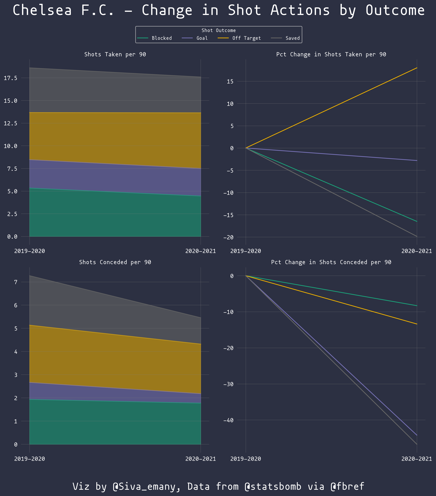
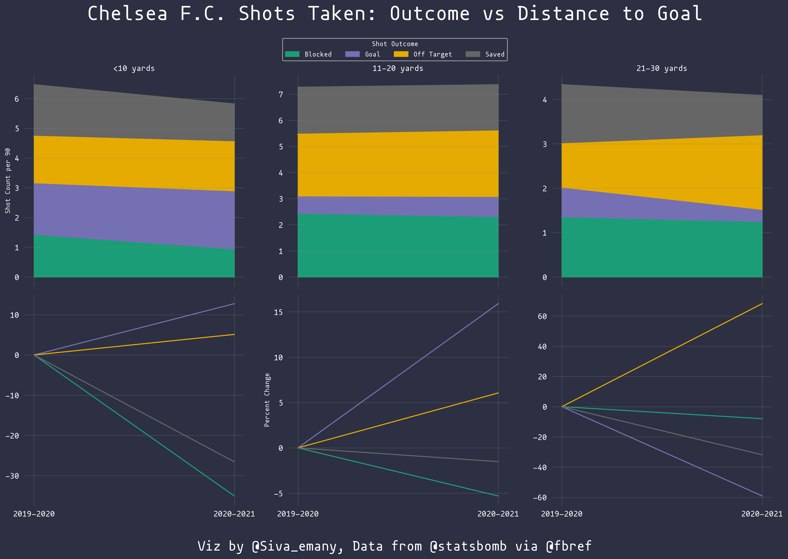
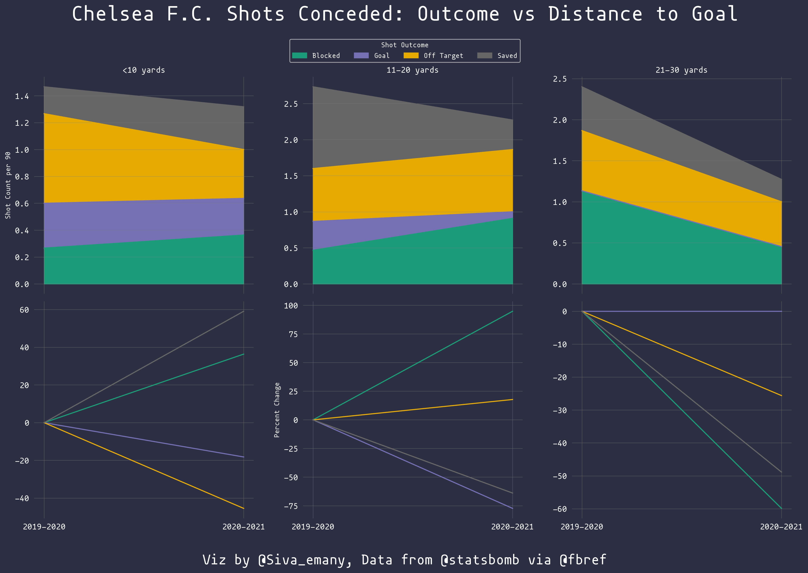
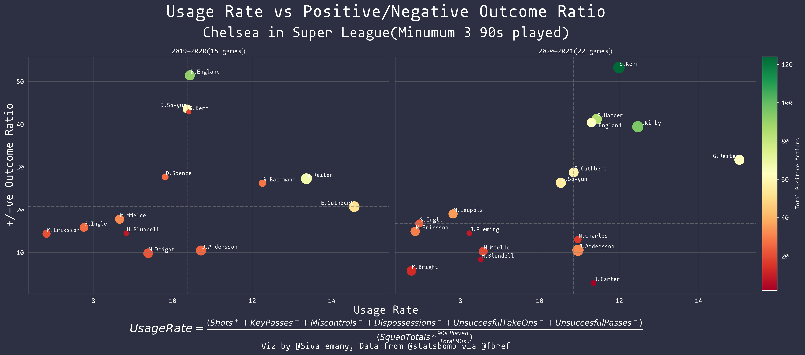
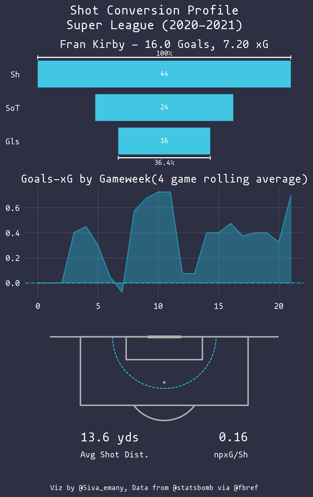
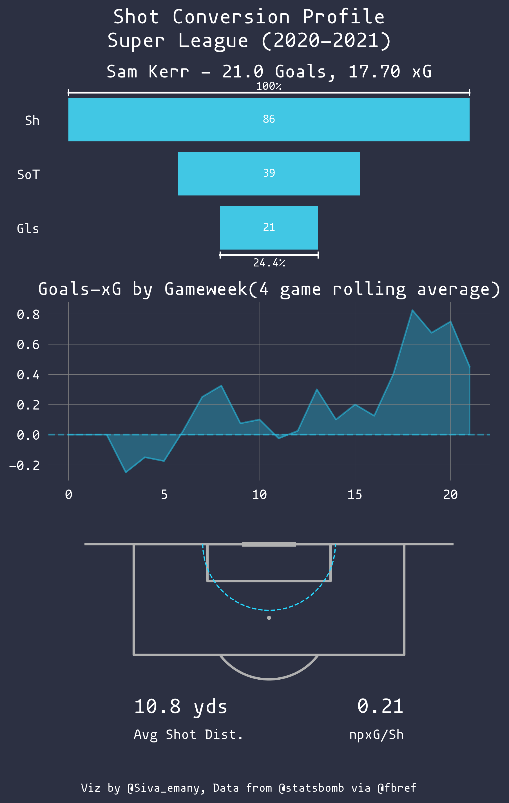
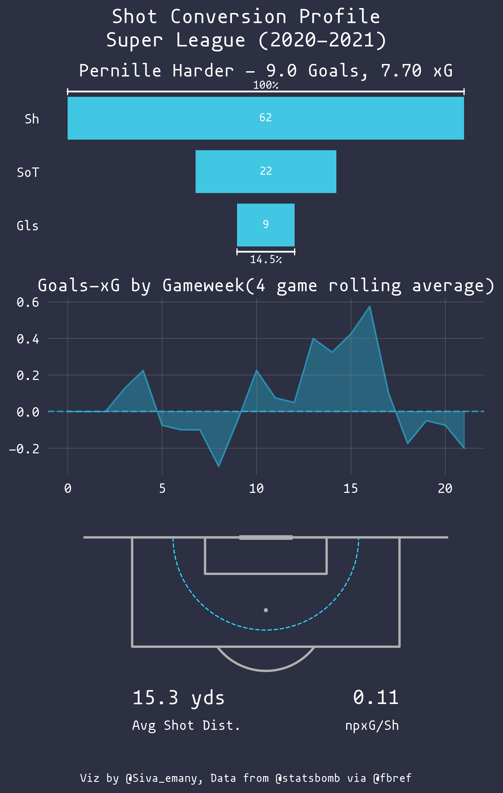
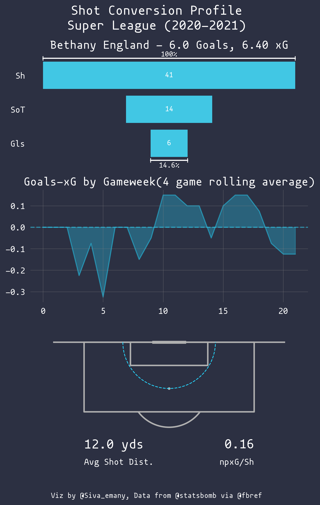

---
aliases:
- /football/2021/09/05/chelsea-fcw-preview-forwards
categories:
- football
date: '2021-09-05'
description: It's Fran Kirby's world and we are all living in it
layout: post
title: Looking at Chelsea FCW's attacking options
toc: true
image: "Fran-Kirby_2020-2021_shot_profile_v2.png"
---

# Trophies galore!!

Chelsea FC Women romped to the title last season. They were scoring goals for fun(a whopping 3 goals per 90) while not conceding very many(0.45 goals againt per 90). But for the uncharacteristic blip against, they may well have finished the season unbeaten. What stands out is just how much a juggernaut Chelsea were last season. They won or reached the final stages of multiple cup competitions, most notably, the Women's Champions League final for the first time in the club's history. They did all this with the help of a very deep and talented squad. No area of this squad is more well stacked than that of the forwards/attacking midfielders.

Chelsea managed to keep the offensive flamboyance of the season before without sacrificing any defensive solidity. Comparing per 90 metrics here as the 2019-2020 season was truncated due to COVID-19.

## Too many ~~cooks~~ forwards ~~spoil~~ make the attack go brrrr!!

The return of Fran Kirby and the additions of Sam Kerr and Pernille Harder changed the face of Chelsea's atack. Ji and Cuthbert were pushed deeper into midfield roles with more of a mandate to keep possession and supply the forwards. The breakout star of 2019-20, Guro Reiten and Bethany England found themselves as options from the bench rather than as starters. Very few teams in England can boast such riches in attack. 

I haven't even mentioned the addition of young talents such as Niamh Charles, Jessie Fleming and now Lauren James. Charles and Fleming are starting to carve roles for themselves in the squad. It remains to be seen how and where Lauren James will fit in. Emma Hayes has a massive challenge on her hands to keep all of these wonderful attacking players happy. 

::: {layout-nrow=2}

:::

The synergy of Kirby and Kerr(a.k.a Kerrby) was a thing to behold. Kirby created and scored goals for fun and had a very very clinical season in front of goal. Kerr started a little slow but in the cruciual run-in period, she exploded and became the player Chelsea thought they were getting in January 2019. Harder had to play second fiddle to these two and curbed some of her attacking instincts in order to play a bigger role in the team's defensive effort. However, if Emma can fully unlock Harder this season, then this trio can take things to a new height.

## Conclusion

Hayes has a lot of juggling to do to keep all these forwards happy. The answer to this may just be to go for a very attacking version of 3-4-3 often employed by Thomas Tuchel. Reiten, Charles and James all present themselves as excellent attacking wingback options. While this move may not be suitable for the biggest of games, it will work like a charm against the rest of the league. The added benefit of being able to secure the wings, which was often a problem in the later stages of CL games last season is great as well.

## Credits

Data was taken from [Fbref.com](https://fbref.com/en/) courtesy of [Statsbomb](https://statsbomb.com/)
